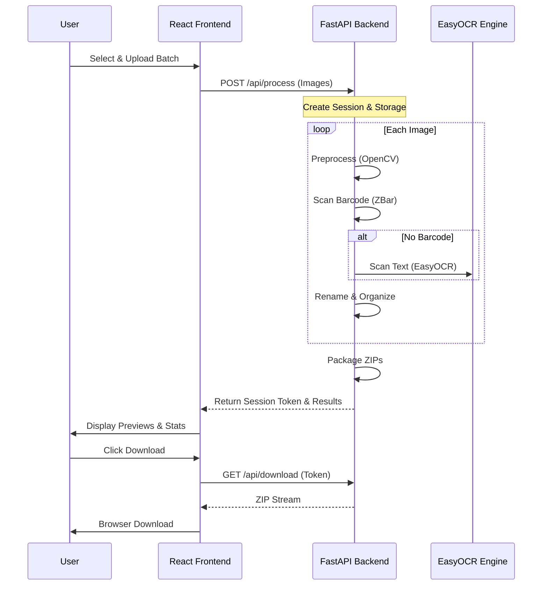

# Saree Organizer - Technical Documentation & HLD

This document provides an exhaustive technical breakdown of the Saree Organizer project, covering architecture, security, and granular function-level details.

---

## 🏗️ High-Level Design (HLD)

### System Architecture
The application follows a **Producer-Consumer** pattern for image processing, where the frontend produces a batch of work and the backend consumes it in an isolated, secure session.

---

## 📂 Backend Deep Dive (`main.py`)

### 🛡️ Security & Utility Functions
*   **`generate_session_token()`**: Uses `secrets.token_urlsafe(32)` to generate a collision-resistant, cryptographically secure string used for per-session authentication.
*   **`validate_session_token(session_id, authorization)`**: 
    *   Checks if the `session_id` exists in the active `temp_dirs` registry.
    *   Verifies that the provided `Authorization: Bearer <token>` matches the session's stored HMAC hash.
    *   Prevents unauthorized access to processed files or download links.
*   **`validate_filename(filename)`**: Sanitizes input filenames by removing directory separators and non-standard characters to prevent **Path Traversal** attacks.
*   **`cleanup_session(session_id)`**: Forcefully deletes the session's temporary directory and removes it from the global registry to free up server disk space.

### 🧠 `SareeSorter` Class
The primary engine for image intelligence.
*   **`preprocess_image(image, method)`**:
    *   `grayscale`: Converts to B&W to reduce noise.
    *   `threshold_otsu`: Automatically adjusts contrast for sharp, high-contrast text.
*   **`decode_frame(image)`**: Configures `pyzbar` to ONLY scan for relevant symbols (Code128, QR, Code39) to avoid DataBar assertion errors and increase speed.
*   **`scan_ocr(image)`**: 
    *   Iterates through prioritized orientations (Normal, 90, 270, 180).
    *   Applies multiple preprocessing methods.
    *   **Early Exit**: Returns immediately upon finding a "VR" pattern to save CPU cycles.
*   **`scan_barcode_from_bytes(image_bytes)`**: 
    1. Converts raw bytes to an OpenCV image pointer.
    2. Runs `decode_frame` (Fast Barcode Scan).
    3. If no barcode, runs `scan_ocr` (Deep AI Scan).

### 🌐 FastAPI Endpoints
*   **`POST /api/process`**:
    *   Validates batch size (Max 1000) and file size (Max 10MB).
    *   Creates isolated folders: `processed/` and `failed/`.
    *   Returns a `ProcessingResult` containing file lists and preview URLs.
*   **`GET /api/preview/{session_id}/{filename}`**: Serves image blobs for the frontend's grid view. Requires valid session authentication.
*   **`POST /api/retry/{session_id}`**: 
    *   Allows users to re-submit a list of failed files.
    *   Re-runs the scanning engine on those specific files and updates the existing session state.

---

## 💻 Frontend Deep Dive (`useProcessing.ts`)

### 🔑 Authentication Helpers
*   **`authenticatedFetch(url, options)`**: Automatically injects the `Authorization` header with the current `sessionToken`. All subsequent preview and download requests go through this.
*   **`getAuthenticatedImageUrl(url)`**: 
    1. Fetches an image via `authenticatedFetch`.
    2. Converts the response to a `Blob`.
    3. Creates a local `ObjectUrl` for memory-efficient display in the UI.

### ⚙️ `useProcessing` Hook Logic
*   **`processImages(images)`**: 
    *   Uses `AbortController` to allow users to cancel long-running uploads.
    *   Converts the backend's JSON response into strongly typed `ProcessedFile` and `FailedFile` objects.
    *   Stores the `sessionToken` in reactive state.
*   **`retryImages(filenames, sessionId)`**: 
    *   Sends a JSON list of files back to the backend.
    *   Merges new successful results into the current UI state without refreshing the whole batch.
*   **`getAuthenticatedDownload(url)`**: 
    *   Programmatically creates a hidden `<a>` tag.
    *   Streams the ZIP file as a blob.
    *   Triggers the "Save As" dialog and cleans up the memory immediately after.

---

## 🚀 Core Functionalities Explained

### 1. The Hybrid Scanner
The system uses a "Fast-Path/Slow-Path" approach. It first tries to find a physical barcode (Fast-Path). If that fails, it engages a deep neural network OCR (Slow-Path) which is more accurate but requires more computational power.

### 2. Session Security Model
The application is "Stateless" by design but "Session-Persistent" by implementation. Every upload is a sandbox. This ensures that multiple users (e.g., Saree shop staff) can process batches simultaneously without their images getting mixed up. 

### 3. Performance Strategy
Since OCR is CPU-heavy, we use **Early Exit** logic. Most "VR" numbers are found in the first 0-degree scan. By exiting at the first match, we reduce the load on the backend by up to 1200% compared to scanning every variation of every image.
