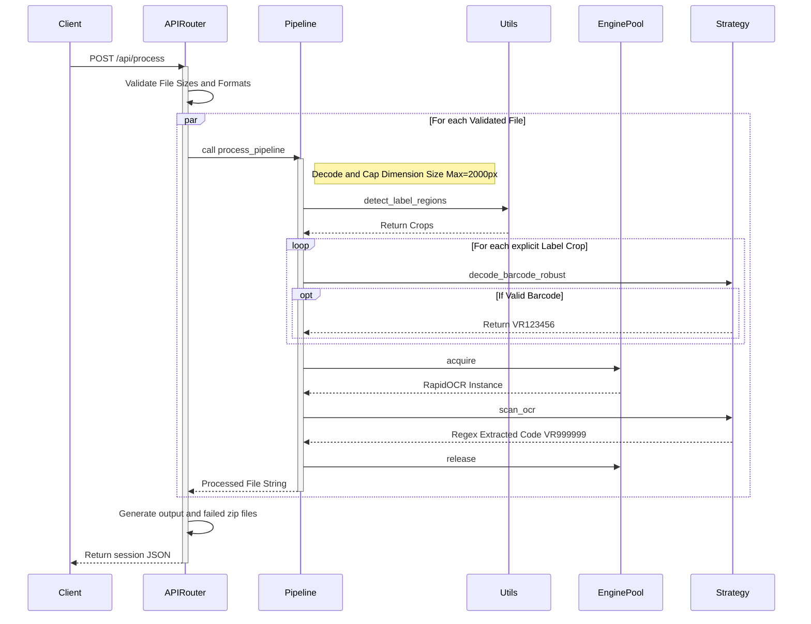

# 🌊 VR Saree Sorter - Code Flow Architecture

This document breaks down the end-to-end execution path for the `vr-image-sorter` backend application. The system follows Domain-Driven Design (DDD), capitalizing on the **Pipeline Design Pattern** and the **Strategy Pattern** to execute image processing.

---

## 1. System Request Architecture

When a client hits the backend with a batch of images to process, the system offloads the blocking CPU-bound OpenCV math onto an async execution pool, preventing the web server from hanging.

## 2. Directory & Module Coupling

Following the **SOLID** refactoring, modules are structurally isolated by operational concern.

- **`backend/api/`**: The presentation layer. `routes.py` maps HTTP domains to internal functionality without knowing *how* the scanning occurs.
- **`backend/core/`**: Configuration, logging constraints, and security. Holds hardcoded validation rules preventing directory traversal attacks during image downloads.
- **`backend/scanner/`**: The primary business logic loop.
    - **`pipeline.py`**: Chains together different computer vision strategies. Evaluates the outputs and manages Python Garbage Collection (`gc.collect()`).
    - **`engine_pool.py`**: Thread-safe queue containing `n` instances of RapidOCR where `n == BATCH_CONCURRENCY`. Decouples memory overhead.
    - **`utils.py`**: Pure OpenCV math functions. Performs heavy morphological operations matching static `KERNEL` arrays.
    - **`strategies/`**: Independent, hot-swappable AI processors (`barcode.py` and `ocr.py`).

## 3. High-Performance Processing Details

### A. Memory Efficiency via Threshold Bypassing
Unlike traditional EasyOCR loops which try 48 different permutations of thresholds and contrasts (ballooning memory allocations), this pipeline acknowledges that **Deep Learning Models process raw RGB arrays better than thresholded logic**. Therefore, Neural Network inference explicitly handles color manipulation natively, drastically dropping Inference cycles from ~45 seconds down to ~14 seconds per batch.

### B. Path Traversal Hardening
When serving zipped artifacts or image previews via `GET /api/download-single/{filename}`, the `routes.py` explicitly normalizes user-provided paths. The requested file path is mathematically run against `base_path.resolve()` absolute anchors. If a malicious client passes `../` constructs, `ValueError` or `startswith` failures immediately throw a 403 HTTP Access Denied error.

### C. Scaling
To scale this application effectively on a cloud provider like **Railway**:
1. Mount a high CPU worker plan.
2. In `core/config.py`, adjust `BATCH_CONCURRENCY` to mathematically match `# of vCPUs / 2`. The Application dynamically widens the RapidOCR pool automatically.
